# Example: Coefficient field inversion in an elliptic partial differential equation

We consider the estimation of a coefficient in an elliptic partial
differential equation as a first model problem. Depending on the
interpretation of the unknowns and the type of measurements, this
model problem arises, for instance, in inversion for groundwater flow
or heat conductivity.  It can also be interpreted as finding a
membrane with a certain spatially varying stiffness. Let
$\Omega\subset\mathbb{R}^n$, $n\in\{1,2,3\}$ be an open, bounded
domain and consider the following problem:

$$
\min_{a} J(a):=\frac{1}{2}\int_\Omega (u-u_d)^2\, dx + \frac{\gamma}{2}\int_\Omega|\nabla a|^2\,dx,
$$

where $u$ is the solution of

$$
\begin{split}
\quad -\nabla\cdot(a\nabla u) &= f \text{ in }\Omega,\\
u &= 0 \text{ on }\partial\Omega.
\end{split}
$$

Here $a\in U_{ad}:=\{a\in L^{\infty}(\Omega)\}$ the unknown coefficient field, $u_d$ denotes (possibly noisy) data, $f\in H^{-1}(\Omega)$ a given force, and $\gamma\ge 0$ the regularization parameter.

### The variational (or weak) form of the state equation:

Find $u\in H_0^1(\Omega)$ such that $(a\nabla u,\nabla v) - (f,v) = 0, \text{ for all } v\in H_0^1(\Omega),$
where $H_0^1(\Omega)$ is the space of functions vanishing on $\partial\Omega$ with square integrable derivatives. Here, $(\cdot\,,\cdot)$ denotes the $L^2$-inner product, i.e, for scalar functions $u,v$ defined on $\Omega$ we denote $(u,v) := \int_\Omega u(x) v(x) \,dx$.

### Optimality System:

The Lagrangian functional $\mathscr{L}:L^\infty(\Omega)\times H_0^1(\Omega)\times H_0^1(\Omega)\rightarrow \mathbb{R}$, which we use as a tool to derive the optimality system, is given by

$$
\mathscr{L}(a,u,p):= \frac{1}{2}(u-u_d,u-u_d) +
\frac{\gamma}{2}(\nabla a, \nabla a) +  (a\nabla u,\nabla p) - (f,p).
$$

The Lagrange multiplier theory shows that, at a solution all variations of the Lagrangian functional with respect to all variables must vanish. These variations of $\mathscr{L}$ with respect to $(p,u,a)$ in directions $(\tilde{u}, \tilde{p}, \tilde{a})$ are given by

$$
  \begin{alignat}{2}
    \mathscr{L}_p(a,u,p)(\tilde{p})  &= (a\nabla u, \nabla \tilde{p}) -
    (f,\tilde{p}) &&= 0,\\
     \mathscr{L}_u(a,u,p)(\tilde{u}) &= (a\nabla p, \nabla \tilde{u}) +
     (u-u_d,\tilde{u}) && = 0,\\
     \mathscr{L}_a(a,u,p)(\tilde{a})  &= \gamma(\nabla a, \nabla \tilde{a}) +
     (\tilde{a}\nabla u, \nabla p) &&= 0,
  \end{alignat}
$$

where the variations $(\tilde{u}, \tilde{p}, \tilde{a})$ are taken from the same spaces as $(u,p,a)$. 

The gradient of the cost functional $\mathcal{J}(a)$ therefore is

$$
    \mathcal{G}(a)(\tilde a) = \gamma(\nabla a, \nabla \tilde{a}) +
     (\tilde{a}\nabla u, \nabla \tilde{p}).
$$

### Goals:

By the end of this notebook, you should be able to:

- solve the forward and adjoint Poisson equations
- understand the inverse method framework
- visualise and understand the results
- modify the problem and code

### Mathematical tools used:

- Finite element method
- Derivation of gradiant via the adjoint method
- Armijo line search

### List of software used:

- <a href="http://fenicsproject.org/">FEniCS</a>, a parallel finite element element library for the discretization of partial differential equations
- <a href="http://www.mcs.anl.gov/petsc/">PETSc</a>, for scalable and efficient linear algebra operations and solvers
- <a href="http://matplotlib.org/">Matplotlib</a>, a python package used for plotting the results
- <a href="http://www.numpy.org/">Numpy</a>, a python package for linear algebra

## Set up

### Import dependencies


```python
import matplotlib.pyplot as plt
%matplotlib inline

from dolfin import *

import numpy as np
import logging


logging.getLogger('FFC').setLevel(logging.WARNING)
logging.getLogger('UFL').setLevel(logging.WARNING)
set_log_active(False)

np.random.seed(seed=1)
```

### Model set up:

As in the introduction, the first thing we need to do is to set up the numerical model.

In this cell, we set the mesh ``mesh``, the finite element spaces ``Va`` and ``Vu`` corresponding to the parameter space and state/adjoint space, respectively. In particular, we use linear finite elements for the parameter space, and quadratic elements for the state/adjoint space.

The true parameter ``atrue`` is the finite element interpolant of the function

$$ a_{\rm true} = \left\{ \begin{array}{l} 4 \; \forall \,(x,y) \, {\rm s.t.}\, \sqrt{ (x-.5)^2 + (y-.5)^2} \leq 0.2 \\ 8 \; {\rm otherwise}. \end{array}\right. $$

The forcing term ``f`` and the boundary conditions ``u0`` for the forward problem are

$$ f = 1 \; \forall {\bf x} \in \Omega, \quad u = 0 \; \forall {\bf x} \in \partial \Omega. $$


```python
# create mesh and define function spaces
nx = 32
ny = 32
mesh = UnitSquareMesh(nx, ny)
Va = FunctionSpace(mesh, 'Lagrange', 1)
Vu = FunctionSpace(mesh, 'Lagrange', 2)

# The true and inverted parameter
atrue = interpolate(Expression('8. - 4.*(pow(x[0] - 0.5,2) + pow(x[1] - 0.5,2) < pow(0.2,2))', degree=5), Va)
a = interpolate(Constant(4.),Va)

# define function for state and adjoint
u = Function(Vu)
p = Function(Vu)

# define Trial and Test Functions
u_trial, p_trial, a_trial = TrialFunction(Vu), TrialFunction(Vu), TrialFunction(Va)
u_test, p_test, a_test = TestFunction(Vu), TestFunction(Vu), TestFunction(Va)

# initialize input functions
f = Constant(1.0)
u0 = Constant(0.0)

# plot
plt.figure()
plot(mesh,title="Mesh")
plt.show()
plt.figure()
plot(atrue,title="True parameter field", mode="warp")
plt.show()
```


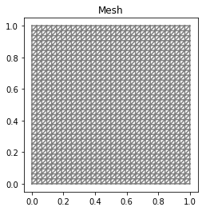


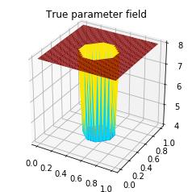


```python
# set up dirichlet boundary conditions
def boundary(x,on_boundary):
    return on_boundary

bc_state = DirichletBC(Vu, u0, boundary)
bc_adj = DirichletBC(Vu, Constant(0.), boundary)
```

### The cost functional evaluation:

$$
J(a):=\underbrace{\frac{1}{2}\int_\Omega (u-u_d)^2\, dx}_{\text misfit} + \underbrace{\frac{\gamma}{2}\int_\Omega|\nabla a|^2\,dx}_{\text reg}
$$

In the code below, $W$ and $R$ are symmetric positive definite matrices that stem from finite element discretization of the misfit and regularization component of the cost functional, respectively.


```python
# Regularization parameter
gamma = 1e-10

# weak for for setting up the misfit and regularization compoment of the cost
W_equ   = inner(u_trial, u_test) * dx
R_equ   = gamma * inner(nabla_grad(a_trial), nabla_grad(a_test)) * dx

W = assemble(W_equ)
R = assemble(R_equ)

# Define cost function
def cost(u, ud, a, W, R):
    diff = u.vector() - ud.vector()
    reg = 0.5 * a.vector().inner(R*a.vector() ) 
    misfit = 0.5 * diff.inner(W * diff)
    return [reg + misfit, misfit, reg]
```

### Set up synthetic observations:

To generate the synthetic observation we first solve the PDE for the state variable ``utrue`` corresponding to the true parameter ``atrue``.
More specifically, we solve the variational problem

Find $u\in H_0^1(\Omega)$ such that 

$$\underbrace{(a_{\text true} \nabla u,\nabla v)}_{\; := \; a_{\rm goal}} - \underbrace{(f,v)}_{\; := \;L_{\rm goal}} = 0, \text{ for all } v\in H_0^1(\Omega)$$.

Then we perturb the true state variable and write the observation ``ud`` as

$$ u_{d} = u_{\rm true} + \eta, \quad {\rm where} \; \eta \sim \mathcal{N}(0, \sigma^2).$$

Here the standard variation $\sigma$ is proportional to ``noise_level``.


```python
# noise level
noise_level = 0.01

# weak form for setting up the synthetic observations
a_goal = inner( atrue * nabla_grad(u_trial), nabla_grad(u_test)) * dx
L_goal = f * u_test * dx

# solve the forward/state problem to generate synthetic observations
goal_A, goal_b = assemble_system(a_goal, L_goal, bc_state)

utrue = Function(Vu)
solve(goal_A, utrue.vector(), goal_b)

ud = Function(Vu)
ud.assign(utrue)

# perturb state solution and create synthetic measurements ud
# ud = u + ||u||/SNR * random.normal
MAX = ud.vector().norm("linf")
noise = Vector()
goal_A.init_vector(noise,1)
noise.set_local( noise_level * MAX * np.random.normal(0, 1, len(ud.vector().array())) )
bc_adj.apply(noise)

ud.vector().axpy(1., noise)

# plot
plt.figure()
plot(utrue, title="State solution with atrue",mode="warp")
plt.show()
plt.figure()
plot(ud, title="Synthetic observations",mode="warp")
plt.show()
```


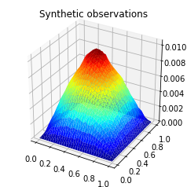


## Setting up the state equations, right hand side for the adjoint and the necessary matrices:

$$
  \begin{alignat}{2}
    \mathscr{L}_p(a,u,p)(\tilde{p})  &= (a\nabla u, \nabla \tilde{p}) -
    (f,\tilde{p}) &&= 0,\\
     \mathscr{L}_u(a,u,p)(\tilde{u}) &= (a\nabla p, \nabla \tilde{u}) +
     (u-u_d,\tilde{u}) && = 0,\\
     \mathscr{L}_a(a,u,p)(\tilde{a})  &= \gamma(\nabla a, \nabla \tilde{a}) +
     (\tilde{a}\nabla u, \nabla p) &&= 0,
  \end{alignat}
$$


```python
# weak form for setting up the state equation
a_state = inner( a * nabla_grad(u_trial), nabla_grad(u_test)) * dx
L_state = f * u_test * dx

# weak form for setting up the adjoint equations
a_adj = inner( a * nabla_grad(p_trial), nabla_grad(p_test) ) * dx
L_adj = -inner(u - ud, p_test) * dx


# weak form for setting up matrices
CT_equ   = inner(a_test * nabla_grad(u), nabla_grad(p_trial)) * dx
M_equ   = inner(a_trial, a_test) * dx


# assemble matrix M
M = assemble(M_equ)
```

## Initial guess
We solve the state equation and compute the cost functional for the initial guess of the parameter ``a_ini``


```python
# solve state equation
A, state_b = assemble_system (a_state, L_state, bc_state)
solve (A, u.vector(), state_b)

# evaluate cost
[cost_old, misfit_old, reg_old] = cost(u, ud, a, W, R)

# plot
plt.figure()
plot(a, title="a_ini",mode="warp")
plt.show()
plt.figure()
plot(u, title="u(a_ini)",mode="warp")
plt.show()
```


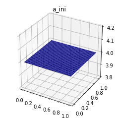


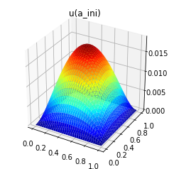


## The steepest descent with Armijo line search:

We solve the constrained optimization problem using the steepest descent method with Armijo line search.

The stopping criterion is based on a relative reduction of the norm of the gradient (i.e. $\frac{\|g_{n}\|}{\|g_{0}\|} \leq \tau$).

The gradient is computed by solving the state and adjoint equation for the current parameter $a$, and then substituing the current state $u$, parameter $a$ and adjoint $p$ variables in the weak form expression of the gradient:

$$ (g, \tilde{a}) = \gamma(\nabla a, \nabla \tilde{a}) +(\tilde{a}\nabla u, \nabla p).$$

The Armijo line search uses backtracking to find $\alpha$ such that a sufficient reduction in the cost functional is achieved.
More specifically, we use backtracking to find $\alpha$ such that:

$$J( a - \alpha g ) \leq J(a) - \alpha c_{\rm armijo} (g,g). $$


```python
# define parameters for the optimization
tol = 1e-4
maxiter = 1000
plot_any = 30
c_armijo = 1e-5

# initialize iter counters
iter = 1
converged = False

# initializations
g = Vector()
R.init_vector(g,0)

a_prev = Function(Va)

print "Nit  cost          misfit        reg         ||grad||       alpha  N backtrack"

while iter <  maxiter and not converged:

    # assemble matrix C
    CT =  assemble(CT_equ)

    # solve the adoint problem
    adj_A, adjoint_RHS = assemble_system(a_adj, L_adj, bc_adj)
    solve(adj_A, p.vector(), adjoint_RHS)

    # evaluate the  gradient
    MG = CT*p.vector() + R * a.vector()
    solve(M, g, MG)

    # calculate the norm of the gradient
    grad_norm2 = g.inner(MG)
    gradnorm = sqrt(grad_norm2)
    
    if iter == 1:
        gradnorm0 = gradnorm

    # linesearch
    it_backtrack = 0
    a_prev.assign(a)
    alpha = 8.e5
    backtrack_converged = False
    for it_backtrack in range(20):
        
        a.vector().axpy(-alpha, g )

        # solve the state/forward problem
        state_A, state_b = assemble_system(a_state, L_state, bc_state)
        solve(state_A, u.vector(), state_b)

        # evaluate cost
        [cost_new, misfit_new, reg_new] = cost(u, ud, a, W, R)

        # check if Armijo conditions are satisfied
        if cost_new < cost_old - alpha * c_armijo * grad_norm2:
            cost_old = cost_new
            backtrack_converged = True
            break
        else:
            alpha *= 0.5
            a.assign(a_prev)  # reset a
            
    if backtrack_converged == False:
        print "Backtracking failed. A sufficient descent direction was not found"
        converged = False
        break

    sp = ""
    print "%3d %1s %8.5e %1s %8.5e %1s %8.5e %1s %8.5e %1s %8.5e %1s %3d" % \
        (iter, sp, cost_new, sp, misfit_new, sp, reg_new, sp, \
        gradnorm, sp, alpha, sp, it_backtrack)

    if (iter % plot_any)==0 :
        plt.figure()
        plot(a, title="a",mode="warp")
        plt.show()
    
    # check for convergence
    if gradnorm < tol*gradnorm0 and iter > 1:
        converged = True
        print "Steepest descent converged in ",iter,"  iterations"
        
    iter += 1
    
if not converged:
    print "Steepest descent did not converge in ", maxiter, " iterations"
```

    Nit  cost          misfit        reg         ||grad||       alpha  N backtrack
      1   4.12912e-06   3.92307e-06   2.06047e-07   1.52436e-05   8.00000e+05     0
      2   3.91185e-06   3.71829e-06   1.93568e-07   5.19644e-07   8.00000e+05     0
      3   3.68081e-06   3.49382e-06   1.86995e-07   5.31748e-07   8.00000e+05     0
      4   3.42693e-06   3.24444e-06   1.82488e-07   5.55925e-07   8.00000e+05     0
      5   3.14133e-06   2.96148e-06   1.79850e-07   5.87562e-07   8.00000e+05     0
      6   2.80841e-06   2.62878e-06   1.79630e-07   6.30743e-07   8.00000e+05     0
      7   2.40676e-06   2.22305e-06   1.83714e-07   6.94667e-07   8.00000e+05     0
      8   2.34319e-06   2.15417e-06   1.89016e-07   7.08385e-07   4.00000e+05     1
      9   2.31098e-06   2.11357e-06   1.97411e-07   3.75179e-06   1.00000e+05     3
     10   2.13356e-06   1.93649e-06   1.97071e-07   7.18427e-07   4.00000e+05     1
     11   2.11625e-06   1.92503e-06   1.91230e-07   4.93037e-07   8.00000e+05     0
     12   2.05497e-06   1.78969e-06   2.65277e-07   1.78443e-04   3.12500e+03     8
     13   1.92720e-06   1.71949e-06   2.07711e-07   8.13007e-07   8.00000e+05     0
     14   1.70543e-06   1.50941e-06   1.96016e-07   6.80580e-07   8.00000e+05     0
     15   1.66465e-06   1.48760e-06   1.77047e-07   1.07661e-06   4.00000e+05     1
     16   1.47612e-06   1.30469e-06   1.71430e-07   5.77832e-07   8.00000e+05     0
     17   1.36002e-06   1.19914e-06   1.60884e-07   4.45571e-07   8.00000e+05     0
     18   1.24872e-06   1.08875e-06   1.59972e-07   4.21676e-07   8.00000e+05     0
     19   1.15024e-06   9.99942e-07   1.50295e-07   3.94140e-07   8.00000e+05     0
     20   1.05586e-06   9.07913e-07   1.47947e-07   3.71410e-07   8.00000e+05     0
     21   9.70218e-07   8.29733e-07   1.40485e-07   3.44479e-07   8.00000e+05     0
     22   8.90357e-07   7.54311e-07   1.36046e-07   3.31161e-07   8.00000e+05     0
     23   8.16142e-07   6.85712e-07   1.30430e-07   3.19565e-07   8.00000e+05     0
     24   7.47075e-07   6.21787e-07   1.25289e-07   3.10626e-07   8.00000e+05     0
     25   6.82912e-07   5.62863e-07   1.20049e-07   3.02190e-07   8.00000e+05     0
     26   6.23367e-07   5.08512e-07   1.14855e-07   2.94583e-07   8.00000e+05     0
     27   5.68215e-07   4.58481e-07   1.09734e-07   2.87751e-07   8.00000e+05     0
     28   5.17271e-07   4.12554e-07   1.04718e-07   2.81753e-07   8.00000e+05     0
     29   4.70373e-07   3.70538e-07   9.98351e-08   2.76704e-07   8.00000e+05     0
     30   4.27359e-07   3.32249e-07   9.51099e-08   2.72797e-07   8.00000e+05     0


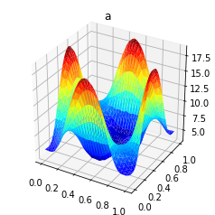


     31   3.88066e-07   2.97485e-07   9.05809e-08   2.70270e-07   8.00000e+05     0
     32   3.52335e-07   2.66043e-07   8.62920e-08   2.69387e-07   8.00000e+05     0
     33   3.20014e-07   2.37711e-07   8.23029e-08   2.70432e-07   8.00000e+05     0
     34   2.90956e-07   2.12280e-07   7.86755e-08   2.73711e-07   8.00000e+05     0
     35   2.65025e-07   1.89536e-07   7.54887e-08   2.79549e-07   8.00000e+05     0
     36   2.42096e-07   1.69271e-07   7.28250e-08   2.88285e-07   8.00000e+05     0
     37   2.22062e-07   1.51267e-07   7.07950e-08   3.00272e-07   8.00000e+05     0
     38   2.04845e-07   1.35325e-07   6.95204e-08   3.15880e-07   8.00000e+05     0
     39   1.90406e-07   1.21230e-07   6.91761e-08   3.35524e-07   8.00000e+05     0
     40   1.78769e-07   1.08800e-07   6.99697e-08   3.59695e-07   8.00000e+05     0
     41   1.70056e-07   9.78351e-08   7.22214e-08   3.89027e-07   8.00000e+05     0
     42   1.64532e-07   8.81857e-08   7.63467e-08   4.24380e-07   8.00000e+05     0
     43   1.62689e-07   7.96695e-08   8.30192e-08   4.66956e-07   8.00000e+05     0
     44   1.09608e-07   7.57331e-08   3.38748e-08   5.18458e-07   4.00000e+05     1
     45   9.99636e-08   6.86609e-08   3.13027e-08   1.18019e-07   8.00000e+05     0
     46   9.14369e-08   6.24236e-08   2.90134e-08   1.15172e-07   8.00000e+05     0
     47   8.39581e-08   5.69038e-08   2.70543e-08   1.14751e-07   8.00000e+05     0
     48   7.75046e-08   5.20159e-08   2.54887e-08   1.17878e-07   8.00000e+05     0
     49   7.21219e-08   4.76686e-08   2.44533e-08   1.26083e-07   8.00000e+05     0
     50   6.79608e-08   4.38072e-08   2.41536e-08   1.41234e-07   8.00000e+05     0
     51   6.53431e-08   4.03538e-08   2.49893e-08   1.65438e-07   8.00000e+05     0
     52   6.48721e-08   3.72823e-08   2.75899e-08   2.01039e-07   8.00000e+05     0
     53   5.29760e-08   3.58666e-08   1.71095e-08   2.50847e-07   4.00000e+05     1
     54   4.93072e-08   3.32488e-08   1.60584e-08   7.86109e-08   8.00000e+05     0
     55   4.61339e-08   3.08946e-08   1.52393e-08   8.10389e-08   8.00000e+05     0
     56   4.34895e-08   2.87804e-08   1.47090e-08   8.73400e-08   8.00000e+05     0
     57   4.14649e-08   2.68696e-08   1.45952e-08   9.89440e-08   8.00000e+05     0
     58   4.02444e-08   2.51518e-08   1.50926e-08   1.17402e-07   8.00000e+05     0
     59   4.01684e-08   2.35901e-08   1.65782e-08   1.44415e-07   8.00000e+05     0
     60   3.39598e-08   2.28733e-08   1.10865e-08   1.82016e-07   4.00000e+05     1


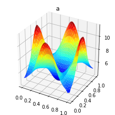


     61   3.21095e-08   2.15268e-08   1.05827e-08   5.64340e-08   8.00000e+05     0
     62   3.05061e-08   2.03066e-08   1.01995e-08   5.86188e-08   8.00000e+05     0
     63   2.91718e-08   1.91945e-08   9.97732e-09   6.36928e-08   8.00000e+05     0
     64   2.81601e-08   1.81860e-08   9.97414e-09   7.26932e-08   8.00000e+05     0
     65   2.75758e-08   1.72622e-08   1.03137e-08   8.67461e-08   8.00000e+05     0
     66   2.52903e-08   1.68371e-08   8.45323e-09   1.07098e-07   4.00000e+05     1
     67   2.41971e-08   1.60318e-08   8.16533e-09   4.07976e-08   8.00000e+05     0
     68   2.32259e-08   1.52965e-08   7.92940e-09   4.11483e-08   8.00000e+05     0
     69   2.23797e-08   1.46217e-08   7.75796e-09   4.29822e-08   8.00000e+05     0
     70   2.16720e-08   1.40049e-08   7.66706e-09   4.69475e-08   8.00000e+05     0
     71   2.11336e-08   1.34363e-08   7.69733e-09   5.38000e-08   8.00000e+05     0
     72   2.08235e-08   1.29169e-08   7.90656e-09   6.43647e-08   8.00000e+05     0
     73   1.95633e-08   1.26726e-08   6.89072e-09   7.95665e-08   4.00000e+05     1
     74   1.89622e-08   1.22120e-08   6.75019e-09   3.02314e-08   8.00000e+05     0
     75   1.84229e-08   1.17865e-08   6.63632e-09   3.06064e-08   8.00000e+05     0
     76   1.79476e-08   1.13947e-08   6.55290e-09   3.20583e-08   8.00000e+05     0
     77   1.75446e-08   1.10313e-08   6.51335e-09   3.50594e-08   8.00000e+05     0
     78   1.72313e-08   1.06966e-08   6.53468e-09   4.01661e-08   8.00000e+05     0
     79   1.70404e-08   1.03844e-08   6.65602e-09   4.79938e-08   8.00000e+05     0
     80   1.70306e-08   1.00976e-08   6.93308e-09   5.92359e-08   8.00000e+05     0
     81   1.59819e-08   9.96077e-09   6.02113e-09   7.47370e-08   4.00000e+05     1
     82   1.56597e-08   9.70246e-09   5.95721e-09   2.33711e-08   8.00000e+05     0
     83   1.53711e-08   9.46142e-09   5.90970e-09   2.44529e-08   8.00000e+05     0
     84   1.51209e-08   9.23773e-09   5.88321e-09   2.66411e-08   8.00000e+05     0
     85   1.49189e-08   9.02799e-09   5.89091e-09   3.03508e-08   8.00000e+05     0
     86   1.47831e-08   8.83360e-09   5.94955e-09   3.60495e-08   8.00000e+05     0
     87   1.47459e-08   8.65009e-09   6.09581e-09   4.42650e-08   8.00000e+05     0
     88   1.41562e-08   8.56446e-09   5.59173e-09   5.56322e-08   4.00000e+05     1
     89   1.39477e-08   8.39885e-09   5.54886e-09   1.84078e-08   8.00000e+05     0
     90   1.37575e-08   8.24407e-09   5.51347e-09   1.91622e-08   8.00000e+05     0


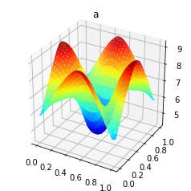


     91   1.35883e-08   8.09823e-09   5.49008e-09   2.06910e-08   8.00000e+05     0
     92   1.34455e-08   7.96200e-09   5.48348e-09   2.33065e-08   8.00000e+05     0
     93   1.33390e-08   7.83295e-09   5.50604e-09   2.73696e-08   8.00000e+05     0
     94   1.32864e-08   7.71274e-09   5.57369e-09   3.32885e-08   8.00000e+05     0
     95   1.29492e-08   7.65481e-09   5.29437e-09   4.15454e-08   4.00000e+05     1
     96   1.28040e-08   7.54425e-09   5.25971e-09   1.49745e-08   8.00000e+05     0
     97   1.26691e-08   7.43963e-09   5.22951e-09   1.54623e-08   8.00000e+05     0
     98   1.25462e-08   7.34123e-09   5.20498e-09   1.64799e-08   8.00000e+05     0
     99   1.24381e-08   7.24771e-09   5.19042e-09   1.82609e-08   8.00000e+05     0
    100   1.23503e-08   7.15991e-09   5.19043e-09   2.10861e-08   8.00000e+05     0
    101   1.22924e-08   7.07595e-09   5.21646e-09   2.52764e-08   8.00000e+05     0
    102   1.22809e-08   6.99750e-09   5.28337e-09   3.12032e-08   8.00000e+05     0
    103   1.19874e-08   6.95928e-09   5.02815e-09   3.93214e-08   4.00000e+05     1
    104   1.18863e-08   6.88630e-09   5.00000e-09   1.28397e-08   8.00000e+05     0
    105   1.17922e-08   6.81674e-09   4.97549e-09   1.34801e-08   8.00000e+05     0
    106   1.17068e-08   6.75100e-09   4.95582e-09   1.46450e-08   8.00000e+05     0
    107   1.16330e-08   6.68805e-09   4.94496e-09   1.65510e-08   8.00000e+05     0
    108   1.15760e-08   6.62875e-09   4.94723e-09   1.94525e-08   8.00000e+05     0
    109   1.15447e-08   6.57154e-09   4.97312e-09   2.36416e-08   8.00000e+05     0
    110   1.13735e-08   6.54459e-09   4.82887e-09   2.94647e-08   4.00000e+05     1
    111   1.12945e-08   6.49168e-09   4.80287e-09   1.09383e-08   8.00000e+05     0
    112   1.12200e-08   6.44140e-09   4.77863e-09   1.13145e-08   8.00000e+05     0
    113   1.11508e-08   6.39319e-09   4.75759e-09   1.20418e-08   8.00000e+05     0
    114   1.10884e-08   6.34747e-09   4.74091e-09   1.32827e-08   8.00000e+05     0
    115   1.10356e-08   6.30339e-09   4.73221e-09   1.52379e-08   8.00000e+05     0
    116   1.09973e-08   6.26179e-09   4.73549e-09   1.81403e-08   8.00000e+05     0
    117   1.09817e-08   6.22134e-09   4.76034e-09   2.22600e-08   8.00000e+05     0
    118   1.08310e-08   6.20229e-09   4.62875e-09   2.79232e-08   4.00000e+05     1
    119   1.07707e-08   6.16468e-09   4.60602e-09   9.71667e-09   8.00000e+05     0
    120   1.07137e-08   6.12884e-09   4.58489e-09   1.01456e-08   8.00000e+05     0


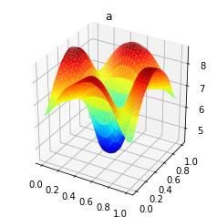


    121   1.06609e-08   6.09428e-09   4.56667e-09   1.09206e-08   8.00000e+05     0
    122   1.06139e-08   6.06144e-09   4.55243e-09   1.21955e-08   8.00000e+05     0
    123   1.05751e-08   6.02958e-09   4.54548e-09   1.41562e-08   8.00000e+05     0
    124   1.05490e-08   5.99949e-09   4.54949e-09   1.70176e-08   8.00000e+05     0
    125   1.05432e-08   5.97001e-09   4.57319e-09   2.10316e-08   8.00000e+05     0
    126   1.04095e-08   5.95615e-09   4.45338e-09   2.65075e-08   4.00000e+05     1
    127   1.03623e-08   5.92865e-09   4.43361e-09   8.73646e-09   8.00000e+05     0
    128   1.03177e-08   5.90238e-09   4.41531e-09   9.19677e-09   8.00000e+05     0
    129   1.02766e-08   5.87693e-09   4.39966e-09   9.99658e-09   8.00000e+05     0
    130   1.02404e-08   5.85271e-09   4.38766e-09   1.12807e-08   8.00000e+05     0
    131   1.02114e-08   5.82909e-09   4.38232e-09   1.32215e-08   8.00000e+05     0
    132   1.01938e-08   5.80679e-09   4.38700e-09   1.60186e-08   8.00000e+05     0
    133   1.01147e-08   5.79572e-09   4.31896e-09   1.99082e-08   4.00000e+05     1
    134   1.00753e-08   5.77446e-09   4.30080e-09   7.65990e-09   8.00000e+05     0
    135   1.00376e-08   5.75387e-09   4.28378e-09   7.91563e-09   8.00000e+05     0
    136   1.00023e-08   5.73418e-09   4.26810e-09   8.39475e-09   8.00000e+05     0
    137   9.96988e-09   5.71502e-09   4.25486e-09   9.20547e-09   8.00000e+05     0
    138   9.94172e-09   5.69678e-09   4.24494e-09   1.04837e-08   8.00000e+05     0
    139   9.91998e-09   5.67889e-09   4.24109e-09   1.23898e-08   8.00000e+05     0
    140   9.90840e-09   5.66202e-09   4.24638e-09   1.51096e-08   8.00000e+05     0
    141   9.83844e-09   5.65359e-09   4.18486e-09   1.88654e-08   4.00000e+05     1
    142   9.80675e-09   5.63742e-09   4.16933e-09   6.93785e-09   8.00000e+05     0
    143   9.77655e-09   5.62172e-09   4.15484e-09   7.20822e-09   8.00000e+05     0
    144   9.74825e-09   5.60668e-09   4.14157e-09   7.69826e-09   8.00000e+05     0
    145   9.72251e-09   5.59199e-09   4.13051e-09   8.51101e-09   8.00000e+05     0
    146   9.70049e-09   5.57801e-09   4.12249e-09   9.77389e-09   8.00000e+05     0
    147   9.68421e-09   5.56423e-09   4.11998e-09   1.16360e-08   8.00000e+05     0
    148   9.67705e-09   5.55125e-09   4.12579e-09   1.42709e-08   8.00000e+05     0
    149   9.61498e-09   5.54472e-09   4.07026e-09   1.78886e-08   4.00000e+05     1
    150   9.58933e-09   5.53223e-09   4.05710e-09   6.30682e-09   8.00000e+05     0


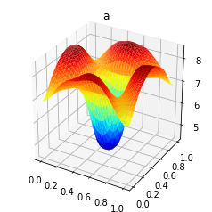


    151   9.56494e-09   5.52006e-09   4.04488e-09   6.58724e-09   8.00000e+05     0
    152   9.54217e-09   5.50840e-09   4.03377e-09   7.08297e-09   8.00000e+05     0
    153   9.52164e-09   5.49697e-09   4.02467e-09   7.89179e-09   8.00000e+05     0
    154   9.50440e-09   5.48610e-09   4.01831e-09   9.13292e-09   8.00000e+05     0
    155   9.49229e-09   5.47533e-09   4.01696e-09   1.09452e-08   8.00000e+05     0
    156   9.48839e-09   5.46522e-09   4.02317e-09   1.34912e-08   8.00000e+05     0
    157   9.43319e-09   5.46009e-09   3.97310e-09   1.69693e-08   4.00000e+05     1
    158   9.41235e-09   5.45031e-09   3.96204e-09   5.74841e-09   8.00000e+05     0
    159   9.39258e-09   5.44075e-09   3.95182e-09   6.03570e-09   8.00000e+05     0
    160   9.37420e-09   5.43160e-09   3.94260e-09   6.53342e-09   8.00000e+05     0
    161   9.35779e-09   5.42259e-09   3.93519e-09   7.33405e-09   8.00000e+05     0
    162   9.34430e-09   5.41404e-09   3.93027e-09   8.54904e-09   8.00000e+05     0
    163   9.33541e-09   5.40552e-09   3.92989e-09   1.03078e-08   8.00000e+05     0
    164   9.33392e-09   5.39755e-09   3.93637e-09   1.27628e-08   8.00000e+05     0
    165   9.28473e-09   5.39347e-09   3.89126e-09   1.61019e-08   4.00000e+05     1
    166   9.26775e-09   5.38573e-09   3.88202e-09   5.25028e-09   8.00000e+05     0
    167   9.25168e-09   5.37815e-09   3.87353e-09   5.54211e-09   8.00000e+05     0
    168   9.23683e-09   5.37089e-09   3.86594e-09   6.03902e-09   8.00000e+05     0
    169   9.22370e-09   5.36372e-09   3.85998e-09   6.82830e-09   8.00000e+05     0
    170   9.21318e-09   5.35692e-09   3.85626e-09   8.01399e-09   8.00000e+05     0
    171   9.20678e-09   5.35011e-09   3.85667e-09   9.71684e-09   8.00000e+05     0
    172   9.17766e-09   5.34693e-09   3.83073e-09   1.20802e-08   4.00000e+05     1
    173   9.16317e-09   5.34051e-09   3.82266e-09   4.64321e-09   8.00000e+05     0
    174   9.14930e-09   5.33433e-09   3.81497e-09   4.80358e-09   8.00000e+05     0
    175   9.13622e-09   5.32826e-09   3.80796e-09   5.09812e-09   8.00000e+05     0
    176   9.12420e-09   5.32245e-09   3.80175e-09   5.59205e-09   8.00000e+05     0
    177   9.11370e-09   5.31669e-09   3.79701e-09   6.36754e-09   8.00000e+05     0
    178   9.10553e-09   5.31125e-09   3.79429e-09   7.52168e-09   8.00000e+05     0
    179   9.10107e-09   5.30577e-09   3.79530e-09   9.16725e-09   8.00000e+05     0
    180   9.07529e-09   5.30322e-09   3.77207e-09   1.14392e-08   4.00000e+05     1


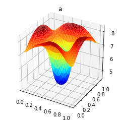


    181   9.06341e-09   5.29805e-09   3.76537e-09   4.23710e-09   8.00000e+05     0
    182   9.05208e-09   5.29307e-09   3.75900e-09   4.40153e-09   8.00000e+05     0
    183   9.04141e-09   5.28818e-09   3.75324e-09   4.69727e-09   8.00000e+05     0
    184   9.03168e-09   5.28350e-09   3.74818e-09   5.18644e-09   8.00000e+05     0
    185   9.02330e-09   5.27884e-09   3.74445e-09   5.94620e-09   8.00000e+05     0
    186   9.01700e-09   5.27446e-09   3.74254e-09   7.06715e-09   8.00000e+05     0
    187   9.01403e-09   5.27001e-09   3.74402e-09   8.65475e-09   8.00000e+05     0
    188   8.99116e-09   5.26796e-09   3.72320e-09   1.08363e-08   4.00000e+05     1
    189   8.98142e-09   5.26377e-09   3.71765e-09   3.87124e-09   8.00000e+05     0
    190   8.97214e-09   5.25975e-09   3.71239e-09   4.03868e-09   8.00000e+05     0
    191   8.96345e-09   5.25577e-09   3.70767e-09   4.33437e-09   8.00000e+05     0
    192   8.95556e-09   5.25198e-09   3.70358e-09   4.81729e-09   8.00000e+05     0
    193   8.94888e-09   5.24820e-09   3.70069e-09   5.55981e-09   8.00000e+05     0
    194   8.94407e-09   5.24464e-09   3.69943e-09   6.64641e-09   8.00000e+05     0
    195   8.94225e-09   5.24102e-09   3.70123e-09   8.17589e-09   8.00000e+05     0
    196   8.92193e-09   5.23935e-09   3.68257e-09   1.02684e-08   4.00000e+05     1
    197   8.91393e-09   5.23595e-09   3.67799e-09   3.54097e-09   8.00000e+05     0
    198   8.90633e-09   5.23267e-09   3.67366e-09   3.71054e-09   8.00000e+05     0
    199   8.89924e-09   5.22943e-09   3.66980e-09   4.00510e-09   8.00000e+05     0
    200   8.89286e-09   5.22635e-09   3.66651e-09   4.48053e-09   8.00000e+05     0
    201   8.88755e-09   5.22326e-09   3.66430e-09   5.20457e-09   8.00000e+05     0
    202   8.88391e-09   5.22036e-09   3.66355e-09   6.25608e-09   8.00000e+05     0
    203   8.88297e-09   5.21740e-09   3.66557e-09   7.72769e-09   8.00000e+05     0
    204   8.86489e-09   5.21604e-09   3.64885e-09   9.73305e-09   4.00000e+05     1
    205   8.85832e-09   5.21326e-09   3.64506e-09   3.24237e-09   8.00000e+05     0
    206   8.85209e-09   5.21059e-09   3.64150e-09   3.41327e-09   8.00000e+05     0
    207   8.84630e-09   5.20793e-09   3.63837e-09   3.70577e-09   8.00000e+05     0
    208   8.84115e-09   5.20542e-09   3.63573e-09   4.17265e-09   8.00000e+05     0
    209   8.83694e-09   5.20288e-09   3.63406e-09   4.87728e-09   8.00000e+05     0
    210   8.83423e-09   5.20052e-09   3.63372e-09   5.89326e-09   8.00000e+05     0


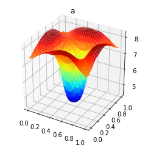


    211   8.83395e-09   5.19808e-09   3.63588e-09   7.30761e-09   8.00000e+05     0
    212   8.81785e-09   5.19698e-09   3.62087e-09   9.22790e-09   4.00000e+05     1
    213   8.81245e-09   5.19469e-09   3.61776e-09   2.97202e-09   8.00000e+05     0
    214   8.80734e-09   5.19250e-09   3.61484e-09   3.14357e-09   8.00000e+05     0
    215   8.80261e-09   5.19032e-09   3.61229e-09   3.43318e-09   8.00000e+05     0
    216   8.79845e-09   5.18826e-09   3.61019e-09   3.89063e-09   8.00000e+05     0
    217   8.79514e-09   5.18617e-09   3.60896e-09   4.57513e-09   8.00000e+05     0
    218   8.79316e-09   5.18424e-09   3.60892e-09   5.55543e-09   8.00000e+05     0
    219   8.78366e-09   5.18323e-09   3.60043e-09   6.91337e-09   4.00000e+05     1
    220   8.77902e-09   5.18133e-09   3.59769e-09   2.63254e-09   8.00000e+05     0
    221   8.77457e-09   5.17945e-09   3.59512e-09   2.72698e-09   8.00000e+05     0
    222   8.77038e-09   5.17765e-09   3.59273e-09   2.89856e-09   8.00000e+05     0
    223   8.76653e-09   5.17586e-09   3.59067e-09   3.18458e-09   8.00000e+05     0
    224   8.76317e-09   5.17417e-09   3.58900e-09   3.63186e-09   8.00000e+05     0
    225   8.76057e-09   5.17244e-09   3.58813e-09   4.29570e-09   8.00000e+05     0
    226   8.75918e-09   5.17086e-09   3.58832e-09   5.24040e-09   8.00000e+05     0
    227   8.75076e-09   5.17003e-09   3.58073e-09   6.54302e-09   4.00000e+05     1
    228   8.74693e-09   5.16846e-09   3.57847e-09   2.40880e-09   8.00000e+05     0
    229   8.74328e-09   5.16691e-09   3.57636e-09   2.50462e-09   8.00000e+05     0
    230   8.73984e-09   5.16544e-09   3.57440e-09   2.67570e-09   8.00000e+05     0
    231   8.73669e-09   5.16395e-09   3.57274e-09   2.95750e-09   8.00000e+05     0
    232   8.73399e-09   5.16256e-09   3.57143e-09   3.39400e-09   8.00000e+05     0
    233   8.73197e-09   5.16114e-09   3.57083e-09   4.03683e-09   8.00000e+05     0
    234   8.73103e-09   5.15984e-09   3.57119e-09   4.94617e-09   8.00000e+05     0
    235   8.72356e-09   5.15915e-09   3.56441e-09   6.19471e-09   4.00000e+05     1
    236   8.72040e-09   5.15786e-09   3.56255e-09   2.20588e-09   8.00000e+05     0
    237   8.71739e-09   5.15658e-09   3.56081e-09   2.30267e-09   8.00000e+05     0
    238   8.71457e-09   5.15536e-09   3.55921e-09   2.47275e-09   8.00000e+05     0
    239   8.71201e-09   5.15414e-09   3.55787e-09   2.74977e-09   8.00000e+05     0
    240   8.70984e-09   5.15299e-09   3.55685e-09   3.17499e-09   8.00000e+05     0


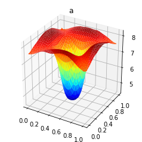


    241   8.70828e-09   5.15181e-09   3.55647e-09   3.79662e-09   8.00000e+05     0
    242   8.70769e-09   5.15075e-09   3.55694e-09   4.67102e-09   8.00000e+05     0
    243   8.70106e-09   5.15017e-09   3.55089e-09   5.86683e-09   4.00000e+05     1
    244   8.69845e-09   5.14911e-09   3.54935e-09   2.02168e-09   8.00000e+05     0
    245   8.69597e-09   5.14805e-09   3.54792e-09   2.11906e-09   8.00000e+05     0
    246   8.69366e-09   5.14705e-09   3.54661e-09   2.28771e-09   8.00000e+05     0
    247   8.69158e-09   5.14603e-09   3.54554e-09   2.55948e-09   8.00000e+05     0
    248   8.68984e-09   5.14509e-09   3.54475e-09   2.97304e-09   8.00000e+05     0
    249   8.68865e-09   5.14411e-09   3.54454e-09   3.57338e-09   8.00000e+05     0
    250   8.68833e-09   5.14324e-09   3.54509e-09   4.41338e-09   8.00000e+05     0
    251   8.68243e-09   5.14276e-09   3.53968e-09   5.55793e-09   4.00000e+05     1
    252   8.68028e-09   5.14188e-09   3.53840e-09   1.85435e-09   8.00000e+05     0
    253   8.67824e-09   5.14100e-09   3.53724e-09   1.95198e-09   8.00000e+05     0
    254   8.67634e-09   5.14017e-09   3.53616e-09   2.11881e-09   8.00000e+05     0
    255   8.67465e-09   5.13933e-09   3.53531e-09   2.38494e-09   8.00000e+05     0
    256   8.67326e-09   5.13856e-09   3.53470e-09   2.78653e-09   8.00000e+05     0
    257   8.67236e-09   5.13774e-09   3.53462e-09   3.36562e-09   8.00000e+05     0
    258   8.67225e-09   5.13703e-09   3.53523e-09   4.17188e-09   8.00000e+05     0
    259   8.66700e-09   5.13663e-09   3.53038e-09   5.26671e-09   4.00000e+05     1
    260   8.66523e-09   5.13590e-09   3.52933e-09   1.70224e-09   8.00000e+05     0
    261   8.66354e-09   5.13518e-09   3.52837e-09   1.79982e-09   8.00000e+05     0
    262   8.66199e-09   5.13449e-09   3.52749e-09   1.96448e-09   8.00000e+05     0
    263   8.66061e-09   5.13379e-09   3.52682e-09   2.22461e-09   8.00000e+05     0
    264   8.65951e-09   5.13316e-09   3.52636e-09   2.61402e-09   8.00000e+05     0
    265   8.65885e-09   5.13248e-09   3.52637e-09   3.17200e-09   8.00000e+05     0
    266   8.65575e-09   5.13218e-09   3.52356e-09   3.94526e-09   4.00000e+05     1
    267   8.65421e-09   5.13155e-09   3.52266e-09   1.51032e-09   8.00000e+05     0
    Steepest descent converged in  267   iterations


```python
plt.figure()
plot(atrue, title="atrue",mode="warp")
plt.show()
plt.figure()
plot(a, title="a",mode="warp")
plt.show()
```


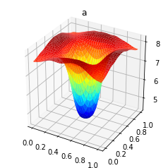


```python
plt.figure()
plot(u, title="u",mode="warp")
plt.show()
plt.figure()
plot(p, title="p",mode="warp")
plt.show()
```


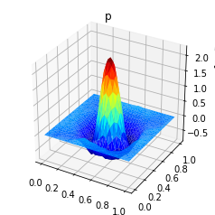

